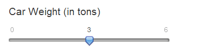

## Introduction

### What this App does?
This App predicts the MPG (miles per gallon) of cars using car weight. 

### Data source
The data are from the data package *mtcars* from R, which is also called Motor Trend Car Road Tests. This data was extracted from the 1974 *Motor Trend* US magazine, and comprises fuel consumption and 10 aspects of automobile design and performance for 32 automobiles (1973-74 models). 

--- .class #id 

## Support Documentation for App

The MPG prediction App predicts the MPG of a car using the weight of the car as the predictor.

- Move the slider to change the car weight input (in tons)
- The results of the prediction are shown on the right panel
- A graph is displayed on the right panel with the MPG values in the y-axis and the car weight values in the x-axis
- An orange mark is placed at the predicted value on the regression line
- The car weight (in tons) value may be changed to see how the predicted value and the graph are updated

--- 

## Demo for the App - Inputs

The weight value of a car can be input by moving the slider.




The responding MPG outcome for the car with the input weight is predicted.

```{r echo=FALSE}
data(mtcars)
predictMPG <- function(weight) { 
        x <- mtcars$wt
        y <- mtcars$mpg
        modelFit <- lm(y~x)
        predict(modelFit, data.frame(x=weight))
}
predictMPG(3)[[1]]
```

--- 

## Demo for the App - Regression Model and Prediction Outputs

The orange dots give the prediction of the MPG with the input car weight.
```{r echo=FALSE, fig.align='center'}
library(lattice)
data(mtcars)
plot(mtcars$wt, mtcars$mpg, xlab="Weight (in tons)", ylab="MPG", xlim=c(0.8,6), ylim=c(8,36), pch=19, col="blue")
abline(lm(mtcars$mpg~mtcars$wt), lwd=2, col="blue")
points(x = 3, y = predictMPG(3), col = 'darkorange', pch = 4, cex = 2, lwd = 5)
```


